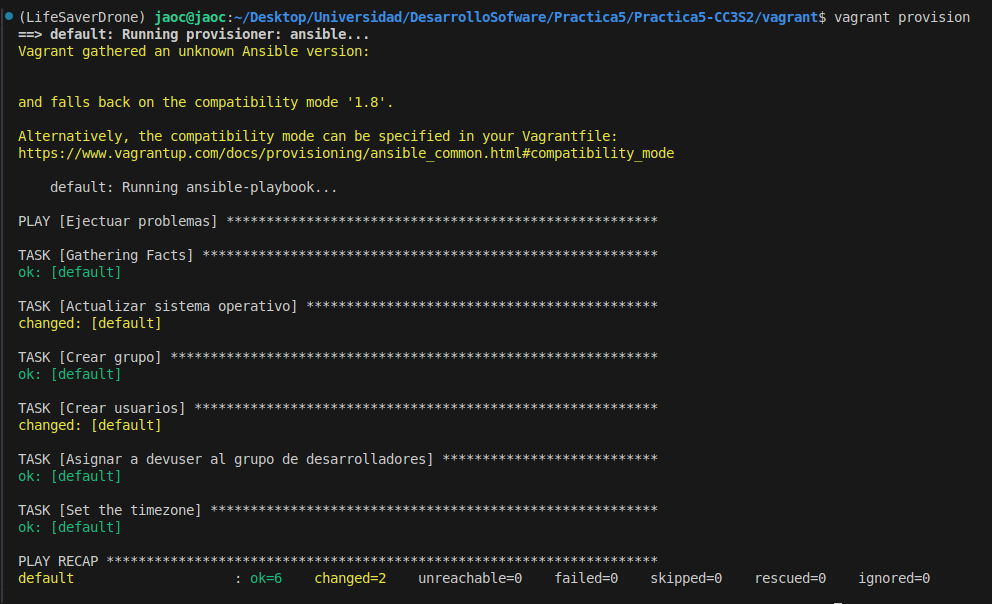
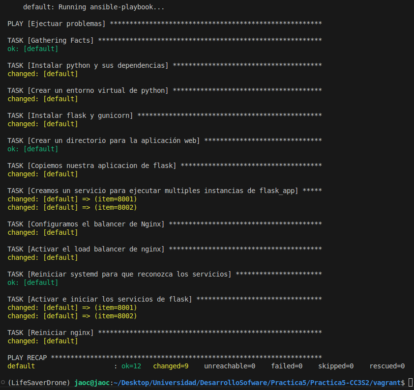
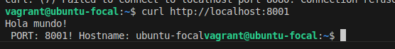
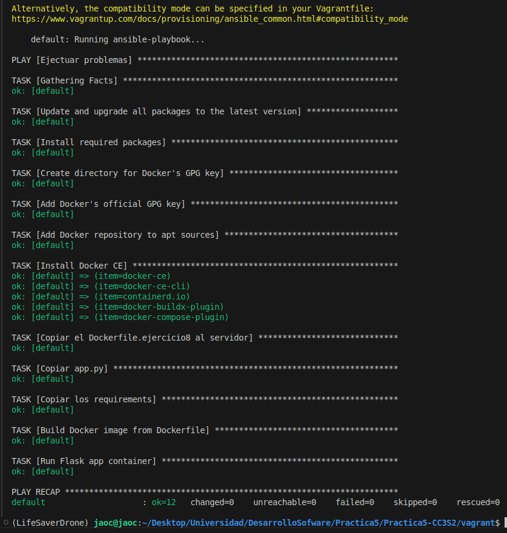
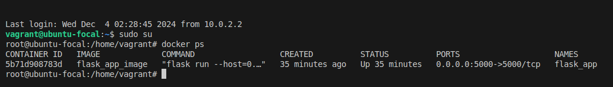
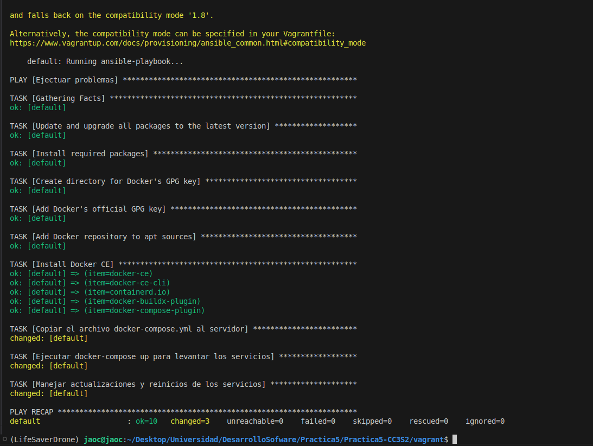
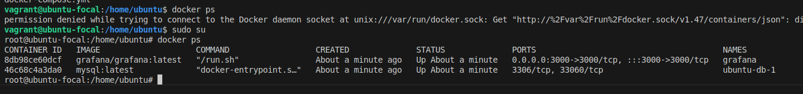

# Practica 5
**Nombre y Apellido:** Jared Orihuela Contreras
**Código:** 20220370F

## Problema 1
Configura una maquina virtual Ubuntu utilizando Vagrant y Ansible. En este ejercicio, deberás:
- Crear la estructura de directorios mencionadas
- Configurar locales y zona horaria
- Crear usuarios y grupos con permisos específicos

## Problema 2
Aumenta la complejidad al desplegar un servicio web seguro. Deberás:
- Instalar y configurar nginx   
- Generar certificados SSL autofirmados para habilitar HTTPS
- Configurar Reglas basicas del firewall (ufw) para permitir solo trafico SSH, HTTP y HTTPS

## Problema 3 
Despliega una aplicación web en mujltiples instancias y configura un balanceador de carga
- Implementar una aplicación flask en varios puertos
- Configurar nginx como balanceador de carga para distribuir el trafico entre las instancias de la aplicacion

### Instrucciones
1. Actualizar site.yml 
2. Crear las tareas en ansible/ejercicio3/main.yml
3. Instalar dependencias de python, crear directorio y copiar la aplicaciòn flask 
4. crear servicios  systemd para cada instancia de la aplicacion en puertos diferentes
5. iniciar y habilitar los servicios de la aplicacion
6. configurar nginx como balanceador de carga. 
Además es necesario crear plantillas necesarias como: 
1. la plantilla de aplicacion de Flask 
2. plantilla para los archivos de servicios systemd  
3. plantilla de configuracion de nginx 
los resultados son:
- aplicacion de flask corriendo en multiples instancias en puertos diferentes
- nginx balanceando el trafico entra las instancias 
- acceso al servicio a traves de http://localhost

## Problema 4 
Implementa soluciones de monitoreo y alertas: , Instalar y configurar Prometheus y Grafana. 
- Configurar alertas básicas en Prometheus.
- Integrar métricas de la aplicación Flask.
### Instrucciones
1. Actualizar site.yml. Agrega la importación de ansible/ejercicio4/main.yml. 
2. Crear las tareas en ansible/ejercicio4/main.yml. Implementa tareas para: 
- Instalar Prometheus y Node Exporter.
- Configurar Prometheus para recopilar métricas de los servicios. 
- Instalar Grafana y configurar su servicio.
- Configurar alertas en Prometheus.
3. Crear el manejador para reiniciar Prometheus.
4. Modificar la aplicación Flask para exponer métricas. Actualiza la aplicación para que exponga métricas compatibles con Prometheus.
5. Asegurarte de instalar las dependencias necesarias.

## Problema 8 - Contenerización de la aplicación con Docker

Empaqueta la aplicación Flask en un contenedor Docker.
Escribe un Dockerfile que construya la imagen de la aplicación. Configura un registro de
contenedores local o utiliza un registro público. Modifica el despliegue para usar
contenedores en lugar de servicios systemd.
### Instrucciones
1. **Crear el Dockerfile**

- Define las etapas necesarias para construir la imagen de la aplicación. b. Incluye
instalación de dependencias y configuración de la aplicación. 
2. **Actualizar site.yml Agrega la importación de ansible/ejercicio8/main.yml.** 
3. **Crear las tareas en ansible/ejercicio8/main.yml Implementa tareas para:**
- Instalar Docker en el sistema.
- Construir la imagen de Docker utilizando el Dockerfile.
- Ejecutar contenedores de la aplicación en los puertos necesarios.
- Configurar Nginx para balancear carga entre los contenedores.
4. **Gestionar imágenes y contenedores**
- Implementa tareas para gestionar versiones de imágenes.
- Configura limpieza automática de imágenes y contenedores antiguos.
5. **Integrar con el proceso de despliegue**
- Asegúrate de que el despliegue con Ansible ahora utiliza contenedores Docker en
lugar de servicios systemd.

Ejecucion exitosa

Se puede visualizar como al entrar a la maquina virtual la aplicación se encuentra activa.

## Resultados esperados
- Aplicación Flask empaquetada en una imagen Docker. (completado)
- Despliegue de la aplicación utilizando contenedores Docker. (completado)
- Nginx balanceando carga entre los contenedores en ejecución. (no completado)

## Problema 9 - Orquestación de contenedores con Docker Compose
Utiliza Docker Compose para orquestar los servicios de la aplicación.
Define un archivo docker-compose.yml que describa la aplicación, base de datos y otros
servicios.
Modifica el despliegue para utilizar Docker Compose con Ansible.
### Instrucciones
1. Crear el archivo docker-compose.yml
- Describe los servicios necesarios: aplicación Flask, base de datos, etc. 
- Configura redes y volúmenes según sea necesario.
2. Actualizar site.yml Agrega la importación de ansible/ejercicio9/main.yml. 3. Crear las
tareas en ansible/ejercicio9/main.yml Implementa tareas para:
- Instalar Docker Compose en el sistema.
- Copiar el archivo docker-compose.yml al servidor.
- Ejecutar docker-compose up para levantar los servicios.
- Manejar actualizaciones y reinicios de los servicios.
4. Gestionar la configuración
a. Utiliza variables y plantillas en Ansible para parametrizar el archivo docker-
compose.yml.

Ejecucion exitosa

Como servicio segundo servicio elegí Grafana, se pueden visualizar los 2 servicios corriendo en contenedores dentro de la maquina virtual.

### Resultados esperados
- Servicios de la aplicación orquestados con Docker Compose. (completado)
- Despliegue simplificado y gestión de múltiples contenedores. (completado)
- Posibilidad de escalar servicios fácilmente. (completado)